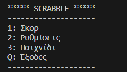
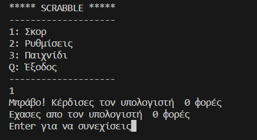
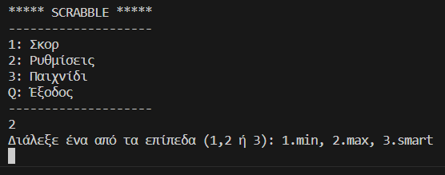
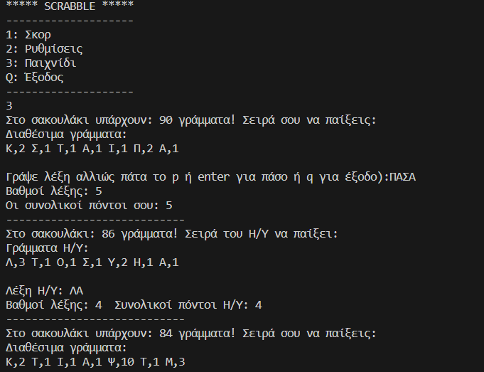
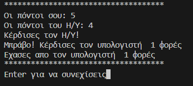

# PythonScrabble

PythonScrabble is a word game in Python in which a player, who plays against pc, score points by placing tiles, each bearing a single letter. The tiles must form words that read left to right and are included in a greek dictionary.

# Main Menu
The game contains a main menu that has 4 choices. The first one is the scoreboard. Player if selects the second one can choose the difficulty of the game between min, max and smart (computer options for words). Third choice of menu consists of the start of the game in random difficulty. The last one is the end of the game and the player exits. 

# Scoreboard
Scoreboard just shows the number of wins of player or pc.

# Settings
The player is capable of selecting 3 different difficulties (min, max, smart). 

# Game
The player can choose a number of letters to form a word. The game counts the value of the letters and removes them from the bag. The computer then takes its turn and forms its word according to difficulty. The game continues in this manner until the bag of letters is empty.

# Quit
If player writes q, the game ends and updates the scoreboard.

